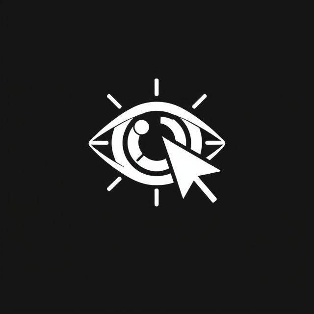

# 👀 Navigaze

Welcome to the **Navigaze** — a Python-based assistant that lets you control your computer using natural voice commands and your face to control your cursor! This project combines speech recognition, gaze-based cursor control, and automation to create a hands-free user experience.

<p align="center">
  
</p>
---

## 🔧 Features

- 🎤 **Voice Recognition**: Understands natural language commands using `speech_recognition` or similar libraries.
- 🖱️ **Mouse Control**: Move the mouse cursor using gaze or directional commands.
- 📄 **Typing**: Dictate text to be typed automatically.
- 🌐 **Browser and Window Navigation**: Switch tabs/windows and control browser behavior.
- 🔍 **Scrolling & Clicking**: Scroll through pages and click with voice commands.
- 🚫 **Pause, Resume, or Stop**: Full control over when the assistant listens or acts.

---

## 📋 List of Voice Commands

Here are some example commands you can use:

| Command            | Description                             |
|--------------------|-----------------------------------------|
| `confirm`          | Left mouse click                        |
| `continue`         | Start gaze tracking                     |
| `pause`            | Pause gaze tracking                     |
| `end all`          | Terminate the assistant                 |
| `up`, `down`       | Move cursor in direction                |
| `move up`          | Same as `up` (natural phrasing)         |
| `switch window`    | Alt + Tab window switcher               |
| `press tab`        | Press the Tab key                       |
| `choose window`    | Finalize selected window (Alt Up)       |
| `switch chrome`    | Switch browser tab (Ctrl + Tab)         |
| `type hello world` | Types `hello world`                     |
| `enter`            | Press Enter                             |
| `open youtube`     | Opens YouTube in browser                |
| `reset`            | Centers the mouse cursor                |
| `close`            | Closes current tab/window               |
| `scroll up`        | Scrolls page up                         |
| `scroll down`      | Scrolls page down                       |

---

# 🖥️ Installation Guide

## Tools Needed:
- Webcam that records entire face
- Microphone
- Python 3.11 (install pip too)
- Computer

1. Install the following Python packages:
```bash
pip install opencv-python mediapipe pyautogui SpeechRecognition pyttsx3 pywinauto
```
2. Set up the repository to be cloned to VSCode or another available IDE.
3. Run the program (main.py) utilizing Python 3.11
4. Choose your preferred microphone from the list of available options in the console (1-#).
5. Choose your preferred webcam from the list of available options in the console (1-#).
6. Happy tracking :)

# 🎙️ Voice Command Reference

This document describes all the available voice commands and their effects in your Python automation assistant.

---

## 🔘 `confirm`
- **Action**: Performs a left mouse click at the current cursor position.
- **Use Case**: Simulates confirming or selecting an item.
- **Implementation**: `pyautogui.click()`

---

## ▶️ `continue`
- **Action**: Starts gaze tracking and cursor control.
- **Effect**: Sets `move_cursor = True`
- **Spoken Feedback**: "Starting gaze direction"

---

## ⏸️ `pause`
- **Action**: Pauses gaze tracking and cursor control.
- **Effect**: Sets `move_cursor = False`
- **Spoken Feedback**: "Stopping gaze direction"

---

## 🛑 `end all`
- **Action**: Terminates all running processes and exits the program.
- **Effect**:
  - Announces shutdown
  - Sets `end_sys = True`
  - Executes `sys.exit()` and `quit()`

---

## ⬆️⬇️⬅️➡️ `up`, `down`, `left`, `right`
- **Action**: Moves the cursor in the specified direction.
- **Implementation**: `move_cursor_func(direction)`

---

## 🔄 `move up`, `move down`, `move left`, `move right`
- **Action**: Same as above, supports commands prefixed with `"move "`.
- **Implementation**: `move_cursor_func(command[5:])`

---

## 🪟 `switch window`
- **Action**: Activates `Alt + Tab` to switch windows.
- **Steps**:
  - Holds `Alt`
  - Presses `Tab`
- **Spoken Feedback**: "say press tab or choose window"

---

## ↹ `press tab`
- **Action**: Sends a `Tab` keystroke to cycle through open windows or tabs.

---

## ✅ `choose window`
- **Action**: Releases the `Alt` key to finalize window switch selection.

---

## 🌐 `switch chrome`
- **Action**: Switches to the next tab in Google Chrome.
- **Steps**:
  - Holds `Ctrl`
  - Presses `Tab`
  - Releases `Ctrl`
- **Spoken Feedback**: "🔀 Switching to next tab..."

---

## ⌨️ `type [text]`
- **Action**: Types the text that follows the word `type`.
- **Example**: `type hello world` types “hello world”.
- **Implementation**: `pyautogui.write(to_type, interval=0.05)`
- **Spoken Feedback**: "Typing"

---

## ⏎ `enter`
- **Action**: Presses the Enter key.
- **Use Case**: Submit a form or send a message.
- **Spoken Feedback**: "🚀 Pressing Enter"

---

## 📺 `open youtube`
- **Action**: Opens YouTube in your default web browser.
- **Implementation**: `webbrowser.open("https://www.youtube.com/")`

---

## 🎯 `reset`
- **Action**: Moves the mouse cursor to the center of the screen.
- **Implementation**: `pyautogui.moveTo(screen_w // 2, screen_h // 2)`

---

## ❌ `close`
- **Action**: Closes the current browser tab or window using `Ctrl + W`.
- **Spoken Feedback**: "Closing window"

---

## 🔼 `scroll up`
- **Action**: Scrolls the page up.
- **Implementation**: `pyautogui.scroll(500)`
- **Spoken Feedback**: "Scrolling up"

---

## 🔽 `scroll down`
- **Action**: Scrolls the page down.
- **Implementation**: `pyautogui.scroll(-500)`
- **Spoken Feedback**: "Scrolling down"
